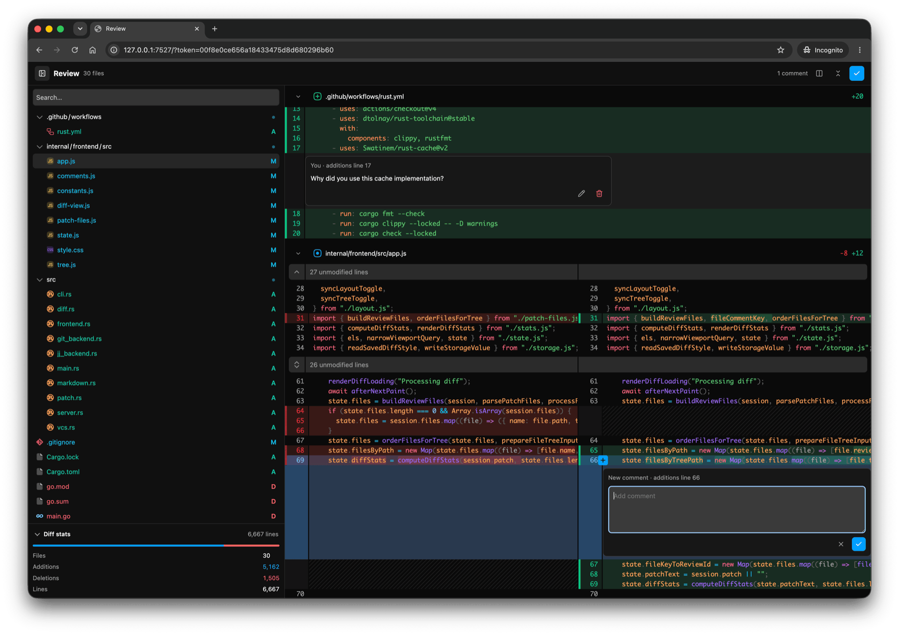

# Review

A local browser UI for reviewing [Jujutsu](https://jj-vcs.github.io/jj/latest/) (`jj`) revsets and Git diffs.

`review` renders one combined diff, lets you leave inline comments, and prints those comments as Markdown when you finish.



## Install

```sh
cargo install --locked --git ssh://git@github.com/notfilippo/review.git
```

## Usage

Run `review` from a Jujutsu or Git repository.

```sh
review
```

The browser opens with the current changes. When you finish, comments are printed to stdout as Markdown.

### Jujutsu (`jj`)

```sh
# Review a revset as one combined diff.
review -r '@'
```

`-r` accepts a Jujutsu revset and is rendered like one `jj diff -r <revset>` review.

### Git

```sh
# Review a commit range.
review --from main --to HEAD
```

### Paths

Pass paths after the revision options to narrow the review.

```sh
review -r '@' src README.md
review --from main --to HEAD src README.md
```

## UI

The browser UI uses Pierre's [@pierre/diffs](https://www.npmjs.com/package/@pierre/diffs) and [@pierre/trees](https://www.npmjs.com/package/@pierre/trees) packages, loaded as native ESM modules through esm.sh.
