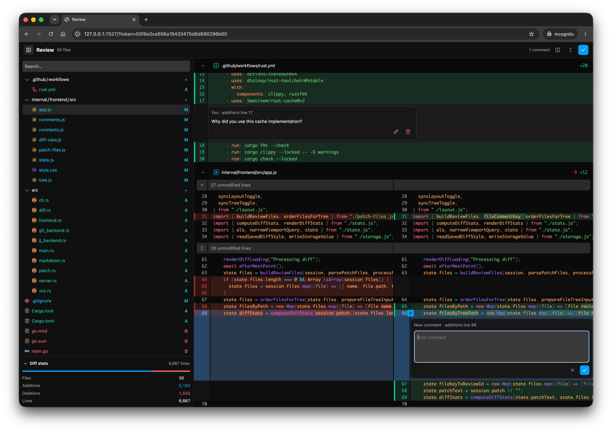

# Review

A local browser UI for reviewing [Jujutsu](https://jj-vcs.github.io/jj/latest/) (`jj`) revsets and Git diffs.

`review` renders one combined diff in your browser, lets you leave inline comments, and prints those comments as Markdown when you finish.



## ⚙️ Install

```sh
cargo install --locked --git ssh://git@github.com/notfilippo/review.git
```

## ▶️ Usage

Run `review` from a Jujutsu or Git repository.

```sh
review
```

The browser opens with the current changes. Leave comments inline, then click **Finish review** to print them to stdout as Markdown.

By default, `review` compares the repository mainline (`trunk()` for jj, the default branch for Git) with your current working copy, including uncommitted changes.

In local-only repos without a discovered Git mainline, it uses an empty base to match jj's root-based `trunk()` behavior.

### Choosing the diff

#### Jujutsu (`jj`)

```sh
# Review a revset as one combined diff, like `jj diff -r <revset>`.
review -r '@'
review -r 'trunk()..@'

# Review between two revisions.
review --from main --to @
```

#### Git

```sh
# Review from a commit through the current worktree, including uncommitted changes.
review --from main

# Review a commit range.
review --from main --to HEAD

# Review a single commit.
review -r HEAD
```

#### Common options

```sh
# Limit the review to some paths.
review src/ docs/README.md

# Serve on a specific port instead of 7527.
review --port 8080
```

## 🔍 Review in the browser

- **Comment:** click or drag over line numbers, or use the `+` in the gutter. Comments are listed in the **Comments** tab.
- **Find references:** `⌘`-click (`Ctrl`-click elsewhere) any symbol in the diff. Matches across the repository appear in the **Search** tab.
- **Search:** `⌘F` / `Ctrl+F`, or the search button, searches the repository for the current selection or anything you type. Match case, whole word and regex are toggles next to the input.
- **Finish:** click **Finish review** to print every comment to stdout as Markdown.

Search results:

- Stream in nearest the diff first: the reviewed files, their directories, then each parent directory up to the repository root. In large monorepos nearby references show up immediately while the rest of the repository is still being walked; **Stop** ends a long search.
- Tag likely definitions with `def` and list them first. This is a keyword heuristic (`fn`, `func`, `class`, `type`, ...), not a language server.
- Read files in the review at the reviewed revision. Everything else comes from the working copy and respects `.gitignore`.
- Jump to the line when it is visible in the diff. Anything else, including unchanged context, opens in a read-only preview below the diff so the review itself stays as it is. `⌘`-click works in the preview too.

### ⌨️ Keyboard shortcuts

| Key | Action |
| --- | --- |
| `j` / `]` | Next file |
| `k` / `[` | Previous file |
| `n` / `p` | Next / previous comment |
| `⌘F` / `Ctrl+F` | Search the repository |
| `⌘`-click / `Ctrl`-click | Find references to a symbol |
| `⌘Enter` / `Ctrl+Enter` | Save the comment being edited |
| `Esc` | Cancel the comment draft, clear the search, or close the preview |

## 🤖 AI Agent Workflow

Two workflows work well with Codex, Claude, or another coding agent.

**Agent runs `review`**

Ask the agent to pick the right diff and wait for the browser review:

```text
Use the `review` CLI to let me review the full code change. Check `review --help`, choose the right diff options for this repository, wait for me to finish in the browser, then use the Markdown comments from stdout to fix the issues.
```

**You run `!review`**

Use this when you want to pick the diff yourself and drive the browser review:

```sh
!review
```

```text
Use the review comments above and fix them.
```

When the command exits, the Markdown comments are still in the conversation context.

## 🛠️ Development

`review` is a single Rust binary. It reads the diff with [`jj-lib`](https://crates.io/crates/jj-lib) or [`gix`](https://crates.io/crates/gix), serves a small local API with [`axum`](https://crates.io/crates/axum), and embeds the frontend from `internal/frontend` at compile time. The server binds to `127.0.0.1` unless `--addr` says otherwise, and every API call requires the per-session token from the URL.

The frontend is plain ES modules with no build step. It uses Pierre's [@pierre/diffs](https://www.npmjs.com/package/@pierre/diffs) and [@pierre/trees](https://www.npmjs.com/package/@pierre/trees), loaded from esm.sh, so the browser needs network access to render the UI.

```sh
cargo build
cargo test
cargo clippy --all-targets -- -D warnings
```

Frontend changes need a rebuild because the assets are embedded in the binary.
